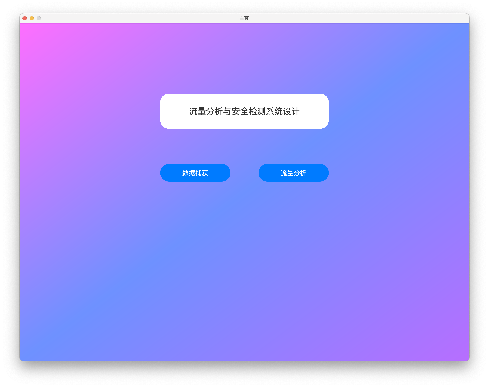
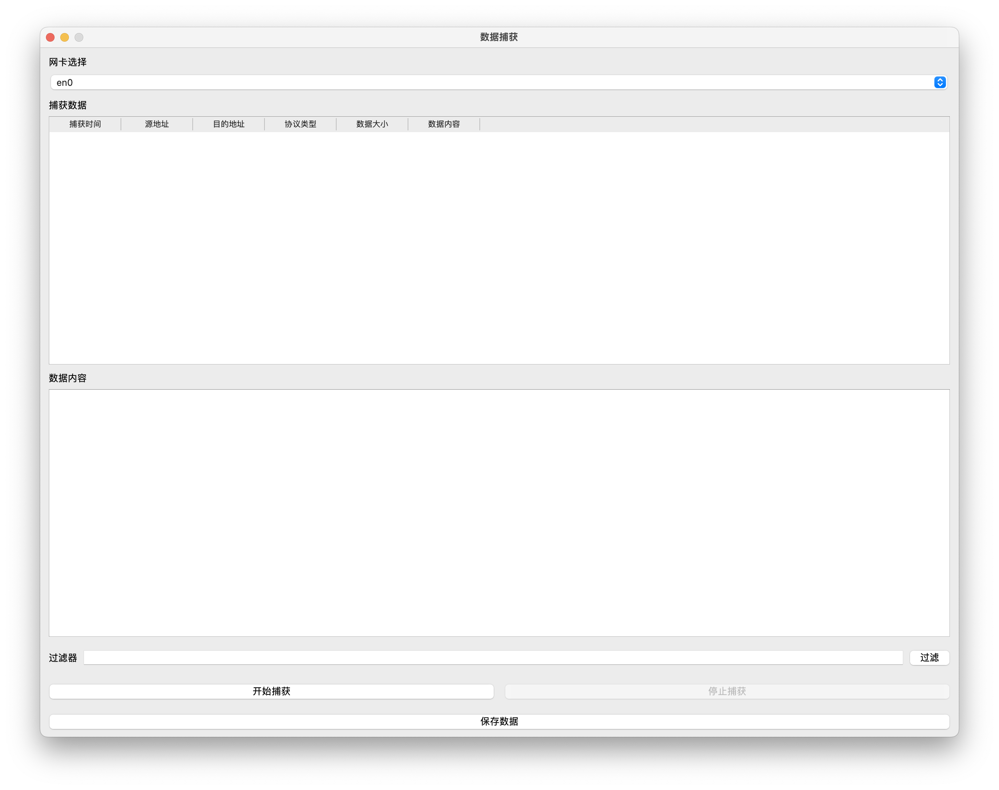
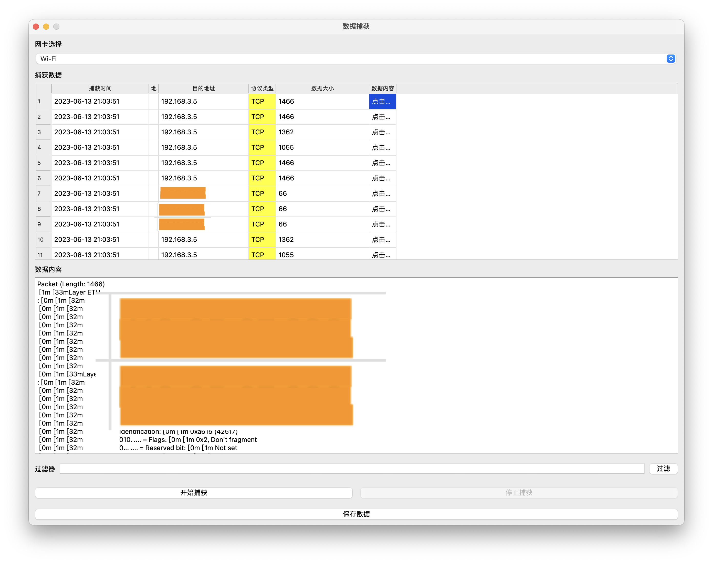
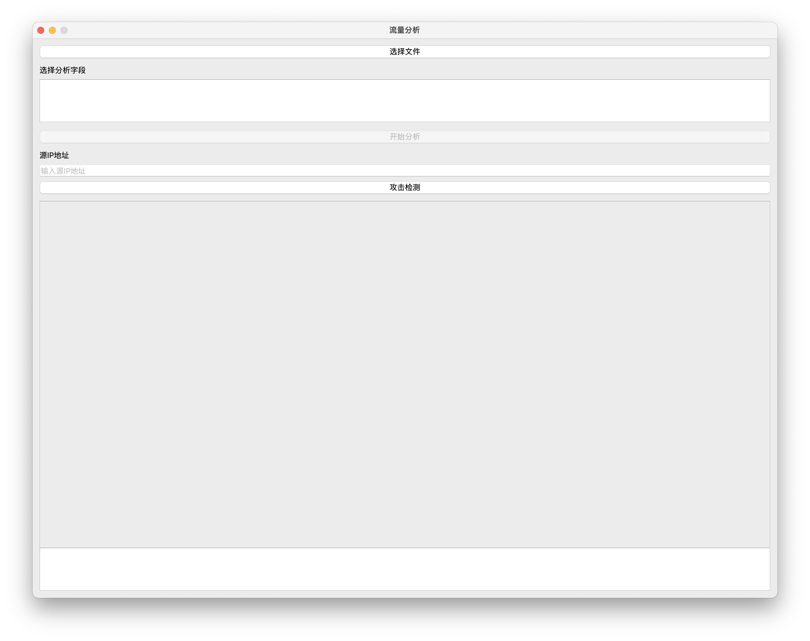
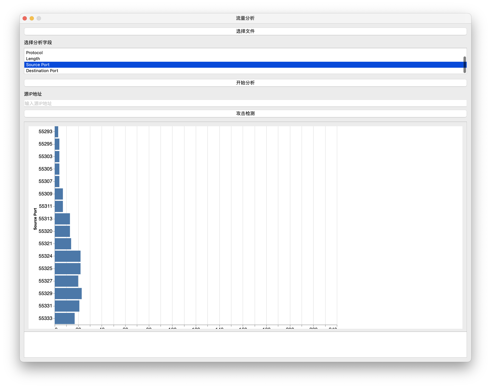

# sniff-system
 基于PyQt6和深度学习的网络入侵检测网络抓包分析工具。
 使用CIC-IDS2017数据集训练模型，使用PyQt6编写界面，使用PyShark进行抓包分析。
## 使用方法
 model文件夹为深度学习算法训练相关，使用简单DNN模型，训练集为CIC-IDS2017数据集，训练集为本地Binary_classification.csv
    使用方法：
    ```shell
    python train.py
    ```
    训练完成后会生成Final_Model文件夹，推理使用predict.py测试
    使用方法：
    ```shell
    python predict.py
    ```
## 抓包工具
 使用PyShark进行抓包分析，使用PyQt6编写界面，使用方法：
    ```shell
    python main.py
    ```

## 环境配置
 pip install -r requirements.txt 安装程序环境

## 界面展示
 主页面

 抓包页面


  分析页面


  
